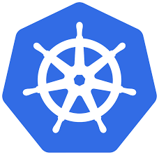

# MongoDB on Kubernetes with Helm

<p align="center">
  
  &nbsp;&nbsp;&nbsp;&nbsp;
  
</p>

A Kubernetes setup for MongoDB and Mongo Express UI, with both raw manifests and a Helm chart.

## Project Structure

```
mongoDB/
├── kubernetes/          # Raw Kubernetes manifests
│   ├── mongo.yaml               # MongoDB Deployment + Service
│   ├── mongo-express.yaml       # Mongo Express Deployment + Service
│   ├── mongo-configmap.yaml     # MongoDB connection URL
│   ├── mongo-secrets.yaml       # MongoDB credentials (base64)
│   └── mongo-pvc.yaml           # PersistentVolumeClaim
└── helm/                # Helm chart
    ├── Chart.yaml
    ├── values.yaml
    └── templates/
        ├── _helpers.tpl
        ├── secret.yaml
        ├── configmap.yaml
        ├── pvc.yaml
        ├── mongo-deployment.yaml
        ├── mongo-service.yaml
        ├── mongo-express-deployment.yaml
        └── mongo-express-service.yaml
```

## Prerequisites

- [Minikube](https://minikube.sigs.k8s.io/)
- [kubectl](https://kubernetes.io/docs/tasks/tools/)
- [Helm](https://helm.sh/)

## Option 1 — Deploy with Helm

### From Helm Repository

**Add the repo:**
```bash
helm repo add mongodb-k8s https://noel-saji.github.io/mongodb-kubernetes-helm/
helm repo update
```

**Install the chart:**
```bash
kubectl create namespace mongo
helm install mongodb mongodb-k8s/mongodb -n mongo
```

### From Local Chart

**Create the namespace:**
```bash
kubectl create namespace mongo
```

**Install the chart:**
```bash
helm install mongodb ./helm -n mongo
```

**Check status:**
```bash
helm status mongodb -n mongo
kubectl get all -n mongo
```

**Upgrade after changes:**
```bash
helm upgrade mongodb ./helm -n mongo
```

**Uninstall:**
```bash
helm uninstall mongodb -n mongo
```

## Option 2 — Deploy with kubectl

```bash
kubectl create namespace mongo
kubectl apply -f kubernetes/ -n mongo
```

## Access Mongo Express UI

```bash
minikube service mongo-express-service -n mongo
```

Or get the Minikube IP and open `http://<minikube-ip>:30000` in your browser.

Default credentials for Mongo Express UI: `admin` / `pass`

## Useful Commands

```bash
# Watch all resources
kubectl get all -n mongo -w

# Check initContainer logs (MongoDB readiness wait)
kubectl logs <mongo-express-pod> -n mongo -c wait-for-mongodb

# Check MongoDB logs
kubectl logs <mongodb-pod> -n mongo

# Switch to mongo namespace permanently
kubectl config set-context --current --namespace=mongo
```

## Notes

- MongoDB data is persisted via a PersistentVolumeClaim (`mongodb-pvc`)
- Mongo Express waits for MongoDB to be ready using an initContainer before starting
- Default StorageClass on Minikube is `standard` (hostpath provisioner)
- Credentials are committed intentionally — this is a testing setup only. Do not use these in production.
  - MongoDB: `admin` / `password`
  - Mongo Express UI: `admin` / `pass`
